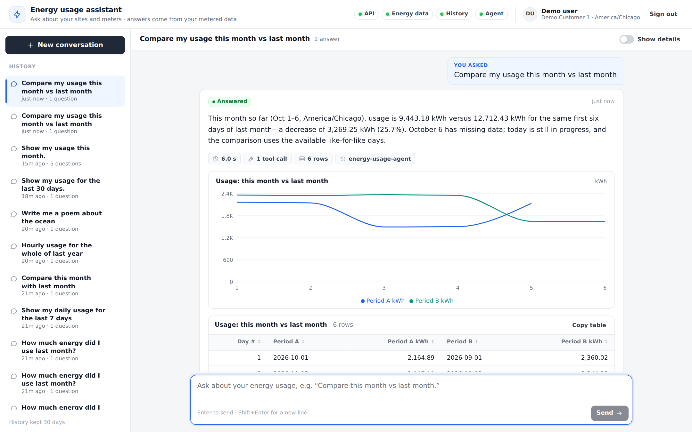
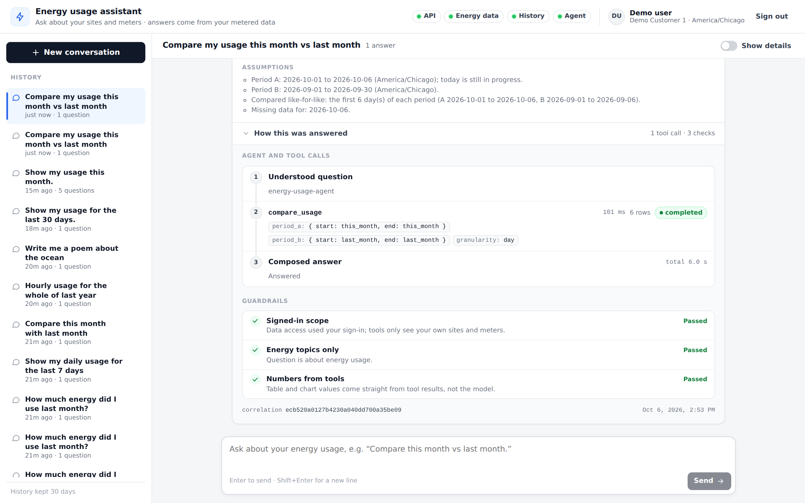
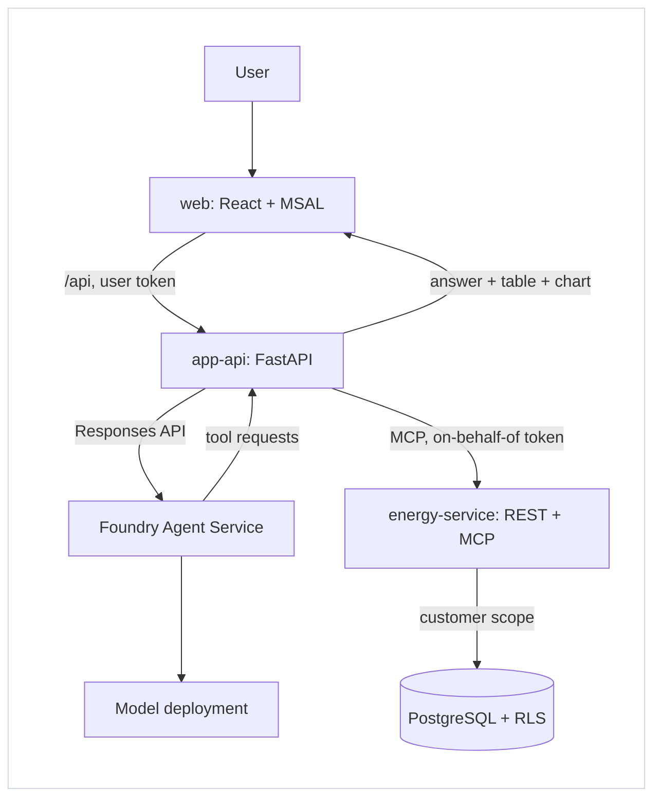

# Energy Usage Agent

**Ask about your energy usage in plain English. Get a short answer, a table and a chart, built only from your own metered data.**

A reference implementation of a secure, observable AI agent on Azure: a React chat app, a Python API, an [Azure AI Foundry](https://learn.microsoft.com/azure/ai-foundry/) prompt agent and an energy data service behind Postgres row-level security.



> [!NOTE]
> Proof of concept with **synthetic data only**. Not a Microsoft product and not supported. See the [disclaimer](#disclaimer).

---

## Contents
- [What it does](#what-it-does)
- [How it works](#how-it-works)
- [Components](#components)
- [Design principles](#design-principles)
- [Run locally](#run-locally)
- [Test](#test)
- [Deploy to Azure](#deploy-to-azure)
- [Observability](#observability)
- [Repository layout](#repository-layout)
- [Documentation](#documentation)
- [Disclaimer](#disclaimer)
- [License](#license)

## What it does
Business users sign in with their work account and ask questions such as:
- "How much energy did I use last month?"
- "Compare this month vs last month."
- "Which meter used the most last week?"
- "When was my peak demand this month?"

Each answer has:
- **Text** from the agent: plain-English, with assumptions stated (time zone, partial periods, missing data).
- **A table and a chart** built by the API from the tool results, **never from model text**.
- **"How this was answered"**: the tool calls with their arguments, row counts and timings, plus guardrail checks.



Also included:
- Conversation history (kept 30 days).
- Follow-up questions in the same conversation.
- Polite refusals for off-topic requests.
- Streaming status while the agent works.

## How it works


One question, step by step:
1. The user asks in the web app. It calls `POST /api/chat` with the user's Entra token.
2. **app-api** validates the token, checks the user is set up, and sends the question to the **Foundry prompt agent** (Responses API).
3. The **model** decides which tools it needs (for example `compare_usage`) and returns tool requests. It never runs them.
4. **app-api** runs each tool against the **energy-service** over MCP with an **on-behalf-of** token for that user.
5. **energy-service** maps the user to their customer and queries Postgres inside a transaction scoped by **row-level security**.
6. app-api returns the tool results to the agent. The model writes the answer and picks which results to show.
7. app-api builds the table and chart from the captured tool results and returns everything to the web app.

Steps 3–6 repeat for at most 5 rounds. Full design: [architecture](docs/architecture.md); sign-in and tokens: [auth flow](docs/auth-flow.md).

## Components
| Component | Tech | Responsibility |
|---|---|---|
| [`frontend/`](frontend/README.md) | React, TypeScript, Vite, MSAL, Recharts, nginx | Sign-in, chat, table and chart, history, "how this was answered". nginx proxies same-origin `/api` to app-api |
| [`services/app-api/`](services/app-api) | Python 3.12, FastAPI | Token validation, onboarding, rate limit, conversation history, the agent tool loop, OBO tokens, table/chart projections |
| [`services/energy-service/`](services/energy-service) | Python 3.12, FastAPI, FastMCP | One core with two adapters, REST `/v1` and MCP `/mcp`. Customer mapping, date and input rules, scoped SQL, audit |
| [`agent/`](agent) | Foundry prompt agent (YAML + JSON) | Instructions, 6 tool specs, output schema, eval policy and golden set. A deploy artifact, no runtime code |
| [`shared/`](shared) | Python package | Auth validators, contracts, problem details, settings, telemetry |
| [`infra/`](infra/README.md) | Bicep, azd | Container Apps, Foundry (project + model), PostgreSQL Flexible Server, App Insights, ACR, Key Vault, managed identities |
| [`scripts/`](scripts) | Python | Local dev, migrations, seed, user mapping, preflight, agent deploy, smoke, evals, deploy verification, CI setup |

Agent tools: `list_sites_and_meters`, `get_usage`, `get_usage_breakdown`, `compare_usage`, `get_peak_usage`, `get_data_coverage`.

## Design principles
- **The customer comes from identity only.** No route, tool or agent argument takes a customer, tenant or user ID. The `(tenant, user)` → customer mapping lives in the database.
- **User tokens never reach Foundry.** The agent only *requests* tools; app-api runs them with an on-behalf-of token.
- **The database enforces scope.** Every query runs with `app.customer_id` set, and RLS blocks everything else.
- **Numbers come from tools.** Displayed values are projections of tool results; the model supplies text and a chart spec.
- **The agent is configuration.** `agent/` is versioned and deployed to Foundry; a new version is created only when it changes.

Each principle is backed by tests (`tests/architecture`, RLS tests on real Postgres, contract tests).

## Run locally
No Azure and no Docker needed. You need **Python 3.12**, [**uv**](https://docs.astral.sh/uv/) and **Node 22**.

```sh
uv sync
(cd frontend && npm ci)
uv run python scripts/dev.py      # Postgres (pgserver) + migrate + seed + both APIs + web
```
Open http://localhost:5173 and pick a demo user:

| User | Meaning |
|---|---|
| `a1`, `a2` | Demo Customer 1 and Demo Customer 2 (same tenant, separate data) |
| `b1` | Demo Customer 3, in a second tenant |
| `x1` | Signed in but not set up ("Your account isn't set up yet") |

Locally the agent is a keyword-based **fake** (answers start with `[fake agent]`). Every number still comes from the real energy-service and database.

| Option | Effect |
|---|---|
| `scripts/dev.py --memory` | In-memory synthetic data, no database |
| `scripts/dev.py --no-web` | APIs only; then `uv run python scripts/smoke.py` |
| `AGENT_MODE=foundry` + `FOUNDRY_PROJECT_ENDPOINT` (after `az login`) | Use the real Foundry agent locally |
| `compose.yaml` | Docker alternative |

## Test
```sh
uv run ruff check . && uv run ruff format --check .
uv run pytest                                   # unit, API, MCP, RLS on Postgres, full stack, architecture
(cd frontend && npm run lint && npm test && npm run build)
```

| Level | What | How |
|---|---|---|
| Unit + API | Services, projections, auth, tool loop, full stack through MCP | `uv run pytest` |
| Data security | RLS and cross-customer isolation on real Postgres | `uv run pytest` (uses `TEST_DATABASE_URL` or a throwaway pgserver) |
| Architecture | Layering, no customer IDs in routes/tools, contracts | `uv run pytest tests/architecture` |
| Frontend | Components and API client | `cd frontend && npm test` |
| Smoke | Sign-in → me → chat (JSON + SSE) → history | `scripts/smoke.py` |
| E2E | Real browser against a deployment | `cd frontend && npm run test:e2e` |
| Agent evals | Golden set: deterministic checks + Foundry judges | `scripts/run_evals.py --mode auto\|quick\|local\|full` |

## Deploy to Azure
Prerequisites:
- An Azure subscription where you can create role assignments (Owner, or Contributor + User Access Administrator).
- Rights to create Entra app registrations (allowed for users in most tenants).
- Quota for the model (default `gpt-5.6-luna`, GlobalStandard).
- [azd](https://learn.microsoft.com/azure/developer/azure-developer-cli/), Azure CLI, uv. No Docker: images are built in Azure Container Registry.

From zero, a person or a coding agent runs:
```sh
azd auth login && az login
azd env new <env-name> && azd env set AZURE_LOCATION <region>
azd up
```

`azd up` does everything; nothing is set by hand:
| Step | What | Where |
|---|---|---|
| 1. Preflight | Checks app-registration rights and model quota; records you as Postgres admin and your IP for the firewall | `scripts/preflight.py` (preprovision hook) |
| 2. Infra | Resource group, Foundry + model, Postgres, Container Apps, App Insights, Key Vault | `infra/main.bicep` |
| 3. App registrations | 3 single-tenant apps, scopes, pre-authorizations, app-api federated credential | `infra/modules/entra.bicep` (Microsoft Graph Bicep) |
| 4. Data | Schema, RLS, roles, synthetic seed; maps **you** to the first demo customer | `migrate.py`, `seed.py`, `map_user.py --me` (postprovision hook) |
| 5. Apps + agent | Builds and deploys the 3 services; publishes the Foundry agent version | `azd deploy`, `deploy_agent.py` |
| 6. Verify | Endpoints, smoke, evals (auto mode), chat trace in App Insights | `scripts/verify_deployment.py` (postdeploy hook) |

Then open `FRONTEND_URL` (`azd env get-value FRONTEND_URL`) and sign in.

Give other people access (members, or guests your tenant admin already invited):
```sh
uv run python scripts/map_user.py --azure --tid <tenant-id> --oid <user-object-id> --customer-id <seeded-customer-id>
```

Re-run checks any time, and the browser E2E:
```sh
uv run python scripts/verify_deployment.py
TOKEN=$(az account get-access-token --scope "$(azd env get-value API_SCOPE)" --query accessToken -o tsv)
(cd frontend && E2E_BASE_URL="$(azd env get-value FRONTEND_URL)" E2E_TOKEN="$TOKEN" npm run test:e2e)
```

CI/CD (GitHub Actions, OIDC, no secrets, no admin):
1. Run `uv run python scripts/setup_ci.py` once from a clone with a GitHub remote (answer **No** when azd offers to push).
2. Every push to `main` deploys code and the agent, then verifies (steps 5–6).
3. Infra or app-registration changes: a person runs `azd up` (steps 1–6). A push that changes `infra/` or `azure.yaml` makes CI stop with that instruction.

Day-2 changes (measured on dev):
| Change | Command | Time |
|---|---|---|
| Infra | `azd provision` | ~6 min |
| Code, all services | `uv run python scripts/deploy_parallel.py` | ~2 min |
| Code, one service | `azd deploy <service>` | 1–3 min |
| Agent definition | `uv run python scripts/deploy_agent.py` (skips when unchanged) | ~2 s |

Details (parameters, app registrations, sign-in, CI): [infra/README.md](infra/README.md).

## Observability
- **One question = one trace.** OpenTelemetry spans from app-api, energy-service and Foundry (agent rounds, model calls, tool calls) land in **Application Insights**.
- **No probe noise, no sampling gaps.** Health probes (`/healthz`) are not traced, and every chat trace is kept whole.
- The Foundry portal's **Tracing** tab reads the same data, so you can follow a question from the browser to the database in either tool.
- Every response carries a correlation ID, shown in the UI.
- App logs hold no prompts or data rows. GenAI spans carry message content (questions, answers, tool result rows) only when `TRACE_CONTENT=true`; it is off by default, turn it on only with synthetic data.
- Span map: [architecture § Chat turn in traces](docs/architecture.md#chat-turn-in-traces). Queries: [`observability/`](observability).

## Repository layout
```
agent/            prompt agent definition, tool specs, evals
frontend/         React app (served by nginx)
services/
  app-api/        chat API and agent tool loop
  energy-service/ energy data: REST /v1 + MCP /mcp
shared/           shared Python package
infra/            Bicep + azd
scripts/          dev, data, deploy, test tooling
observability/    KQL queries
tests/            cross-cutting tests (architecture, scripts)
docs/             specs, architecture, decisions
```
Full map: [docs/project-structure.md](docs/project-structure.md). Guidance for coding agents: [AGENTS.md](AGENTS.md).

## Documentation
| Doc | What's in it |
|---|---|
| [Functional spec](docs/functional-spec.md) | Users, features, example questions |
| [User flow](docs/userflow.md) | Screens and error states |
| [Business rules](docs/business-rules.md) | Scoping, dates, limits, numbers, audit |
| [Technical spec](docs/technical-spec.md) | APIs, contracts, settings, errors |
| [Architecture](docs/architecture.md) | 4+1 views, invariants, traces |
| [Auth flow](docs/auth-flow.md) | Sign-in, token exchange, giving access |
| [Issues, changes, fixes](docs/issues-changes-fixes.md) | Decision and fix log |
| [Plan](docs/plan.md) | Status and next steps |

## Disclaimer
This project is a **proof of concept** for learning and evaluation.
- It is provided **"as is"**, without warranty of any kind, and is **not an official Microsoft product** or service. It is not supported under any Microsoft support program.
- All data is **synthetic** (`scripts/seed.py`). Do not load real customer or personal data into this repository or a development environment.
- It is **not production-ready**. Before any production use, review it for your security, privacy, compliance, networking (private endpoints), scaling and responsible AI requirements.
- AI-generated text can be wrong. The design keeps displayed numbers tied to tool results, but users should verify important figures.
- Running it creates billable Azure resources. Delete them when done: `azd down --purge`, then the 3 app registrations ([infra/README](infra/README.md)).

## License
[MIT](LICENSE).
