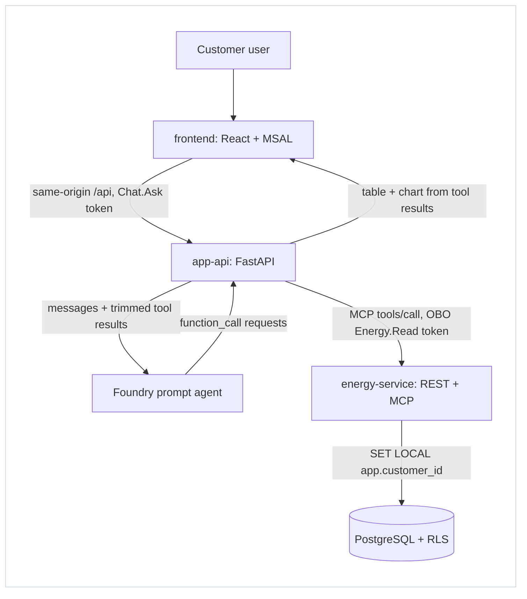
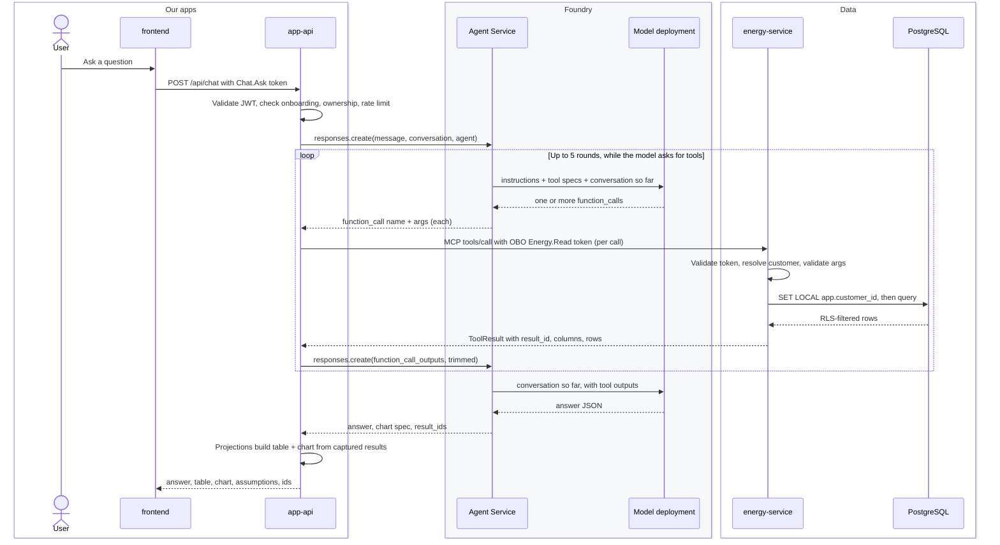
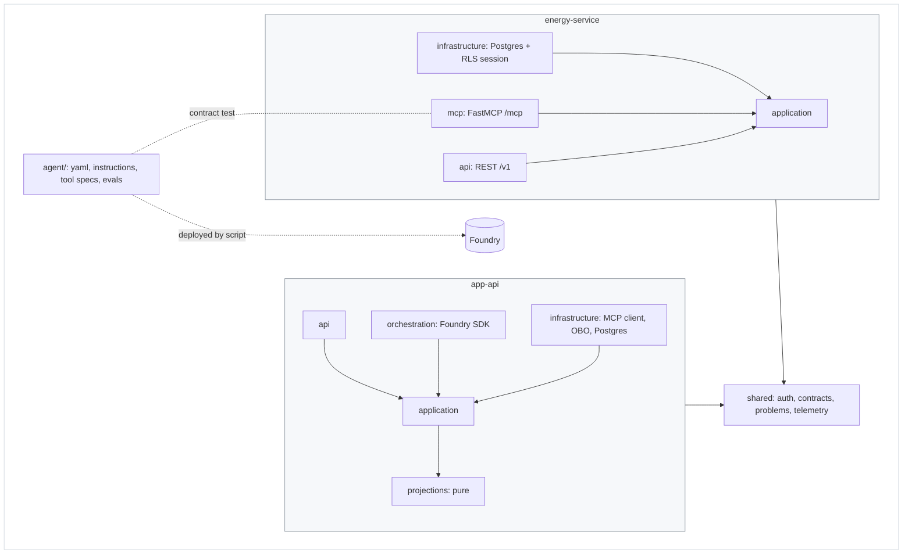
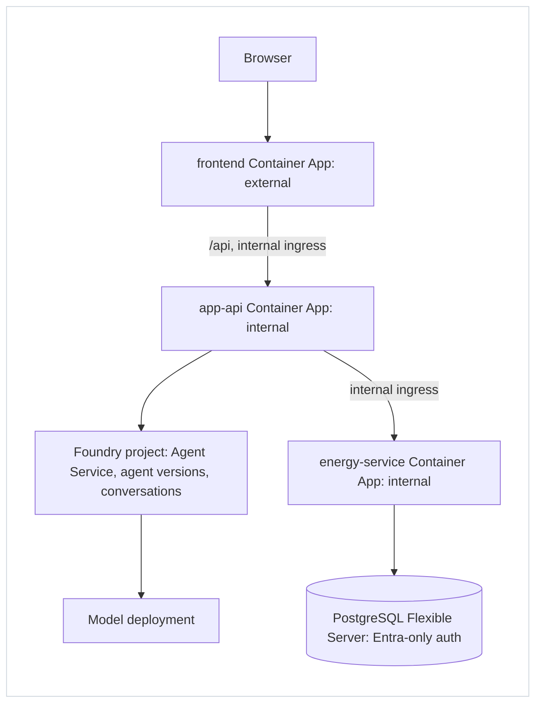

# Architecture: 4+1 views (v0.4)

## Purpose and scope
- Users ask energy-usage questions in plain English and get an answer, a table and a chart, scoped to their own customer.
- This doc owns the runtime design: components, flows, trust boundaries and topology.
- Related:
  - [functional spec](functional-spec.md)
  - [business rules](business-rules.md)
  - [user flow](userflow.md)
  - [technical spec](technical-spec.md)
  - [source map](project-structure.md)
  - [decision log](issues-changes-fixes.md)

## Invariants
Do not break these. Each one is backed by a test.

1. **Customer comes from identity only.**
   - The energy-service resolves `(tid, oid)` → customer.
   - No route, tool or agent tool accepts a customer, tenant or user ID ([BR-1](business-rules.md#customer-scoping-and-onboarding)).
2. **User tokens never reach Foundry.** The agent only *requests* tools. app-api runs them (Option B).
3. **The database enforces scope.** Every query runs in a transaction with `app.customer_id` set. RLS blocks everything else.
4. **Displayed numbers come from tool results.**
   - Projections build the table and chart from captured tool outputs.
   - The LLM supplies text, a chart spec and `result_ids` only ([BR-8](business-rules.md#numbers-and-sources)).
5. **The agent is a deploy artifact, not code.**
   - `agent/` is deployed to Foundry.
   - `orchestration/` is the only code that calls Foundry.
   - There is no Microsoft Agent Framework.

## 1. Logical view
| Component | Owns | Must not |
|---|---|---|
| frontend | Sign-in, chat UI, renders answer/table/chart, keeps `conversationId` | Hold secrets; call anything except `/api` |
| app-api | JWT validation, onboarding check, conversation ownership, rate limit, OBO, the tool loop, projections | Query the DB; trust agent output for numbers |
| Foundry Agent Service | The agent definition (versioned: instructions, tool specs, output schema), conversation state, the Responses API | See tokens or customer IDs; run tools |
| Model deployment | Intent, tool choice, parameters, answer text, chart spec. Stateless: gets the conversation from the Agent Service on every call | Same as above |
| energy-service | Token validation, customer mapping, input + date validation (customer time zone), scoped SQL, audit events | Accept a customer ID from any input |
| PostgreSQL | Energy data, user→customer mapping, RLS policies | Return rows outside `app.customer_id` |

In the energy-service, REST `/v1` and MCP `/mcp` are two thin adapters over **one** application core, so they cannot drift.

## 2. Process view

### Chat turn

- **Round:** one `responses.create` call. The model may ask for several tools in one round (run one after another by app-api); all their outputs go back in the next round.
- **Who holds what:** the Agent Service keeps the conversation; the model is stateless; app-api keeps the tool results it needs for the table and chart.

### Rules of the loop
- **Limit:** at most 5 rounds with tool calls per turn; then the turn ends with a safe error.
- **Allow-list:** app-api runs only tools in the allow-list. An unknown tool name ends the turn with a safe error.
- **Retries:** a failed tool call or model call is retried once, then the user gets an error with a correlation ID ([userflow §5](userflow.md#5-error-and-edge-case-ux)).
- **Onboarding:** the energy-service answers it through `GET /v1/me`. app-api caches the result briefly, so unmapped users are stopped before any Foundry call.
- **Not atomic:** model context lives in the Foundry conversation, while ownership `(conversationId → tid, oid)` and the displayed turns live in the app-api DB. A turn is not one transaction: if saving a turn fails, the user still gets the answer and only the history misses it. Losing the ownership record means "not found", never cross-user access.
- **Streaming:** only the final answer text streams. The table and chart arrive with the final event.

### Chat turn in traces
One question = one `POST /api/chat` = one trace ID. Foundry Tracing reads the same App Insights data, so both show the same trace. A conversation of 10 questions is 10 traces that share a conversation ID.

| Step | Span name | Emitted by |
|---|---|---|
| Request | `POST /api/chat` (root) | app-api (FastAPI instrumentation) |
| Whole agent turn | `invoke_agent <agent>` | app-api `orchestration/foundry.py` |
| One round (`responses.create`) | `invoke_agent <agent>` | azure-ai-projects SDK instrumentation |
| Agent Service handles the round | `invoke_agent <agent>:<version>` | Foundry (role `responsesapi`) |
| Model call | `chat <model>` | Foundry |
| Model asks for parallel tools | `multi_tool_use.parallel` | Foundry |
| One tool run | `execute_tool <tool>` | app-api |
| MCP traffic for a tool | `POST /mcp` → energy-service `POST /{path}` (several: session setup + call) | httpx / FastAPI instrumentation |

## 3. Development view

- Adapters (`api`, `mcp`, `orchestration`, `infrastructure`) depend on `application`, never the other way round.
- `application` imports no web, MCP, Azure, DB or OpenAI libraries.
- `bootstrap.py` wires real or `testing/` adapters. Nothing does work at import time.
- Full tree and contract tests: [project-structure](project-structure.md).

## 4. Physical view

### Azure (POC)

| Boundary | Credential | Notes |
|---|---|---|
| Browser → app-api | User token `Chat.Ask` | Same-origin `/api` through the web app's nginx; Entra single tenant (members + invited guests). Flow: [auth-flow](auth-flow.md) |
| app-api → Foundry | app-api managed identity | Messages + trimmed results only |
| Agent Service → model deployment | Managed by Foundry | Inside the Foundry resource |
| app-api → energy-service | User OBO token `Energy.Read` | Internal ingress; JWT still required |
| energy-service → Postgres | energy-service managed identity | SELECT-only role, not the table owner, so it cannot bypass RLS |

- **Deploy:** `azd` provisions Bicep and deploys 3 containers from ACR (pulled with managed identity). A post-deploy hook publishes `agent/` to Foundry.
- **Observability (App Insights + Log Analytics):**
  - A correlation ID (`x-correlation-id`) flows web → app-api → energy-service and is returned in every response. OpenTelemetry traces from app-api, energy-service and Foundry land in App Insights; Foundry Tracing reads them from there ([span map](#chat-turn-in-traces)).
  - Audit events follow [BR-12](business-rules.md#audit).
  - No prompts or result rows are logged.
- **Local:** `scripts/dev.py` starts Postgres (pgserver, or Compose), both services with uv and Vite, which proxies `/api` to app-api. A fake agent and dev sign-in replace Foundry and Entra. Tests inject `testing/` fakes, so they need no Azure.
- **Later:**
  - Foundry private networking.
  - Private Container Apps environment and Postgres.
  - Optionally APIM.

## 5. Scenarios (+1)
| Scenario | Expected behavior | Evidence (planned) |
|---|---|---|
| Usage this month | 1 `get_usage` call; month-to-date in customer time zone; table + chart | agent eval + e2e |
| Compare months | `compare_usage`; delta + % change; assumptions stated | agent eval |
| Follow-up "and last month?" | Same intent, new period, same conversation | agent eval (multi-turn) |
| Prompt asks for another customer | Refused; tool args carry no customer; data still scoped | prompt security eval + contract test |
| Token from tenant B on tenant A data | RLS returns nothing; no leak | cross-tenant integration test (real Postgres) |
| Unmapped user | `403 not_onboarded`; no Foundry call | app-api unit test |
| Agent requests unknown tool or > 5 rounds | Turn ends with a safe error | orchestration unit test |
| No / partial data | Empty or partial state with missing periods | energy-service unit test + e2e |

## Decisions and alternatives
- **Option B over Option A** (Foundry calling MCP directly):
  - User tokens stay inside our boundary.
  - The MCP endpoint stays internal.
  - Numbers are captured directly.
  - Cost: app-api owns a small tool loop.
- **One energy-service over separate MCP + REST services:** one code path, no token forwarding, one less hop.
